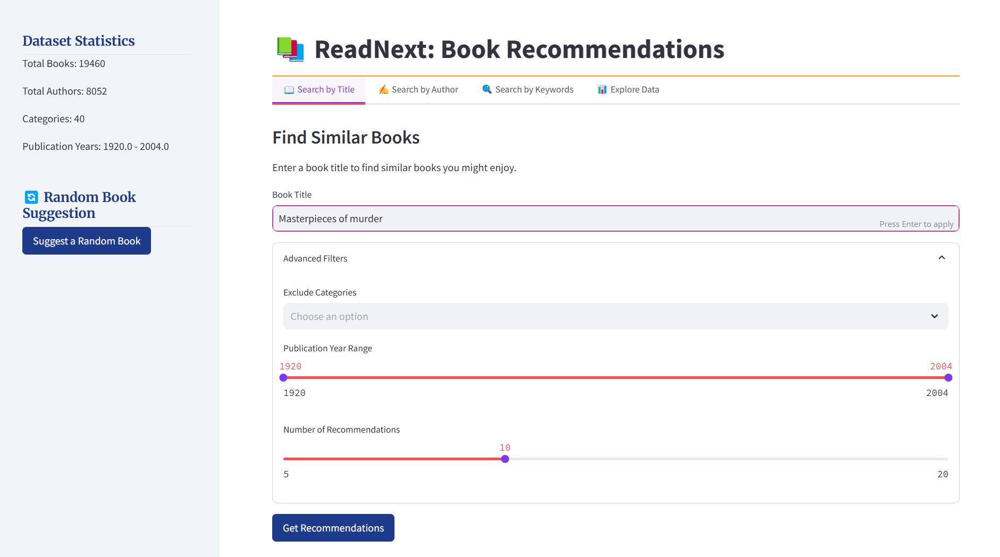
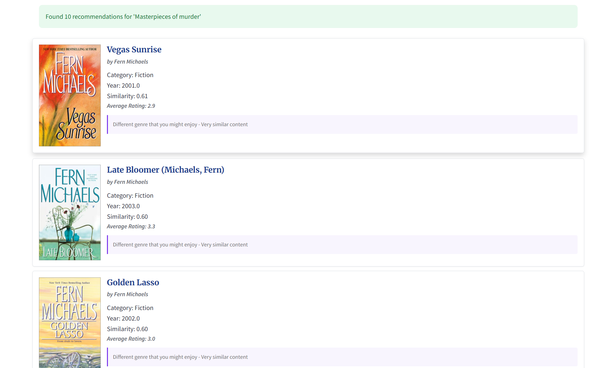
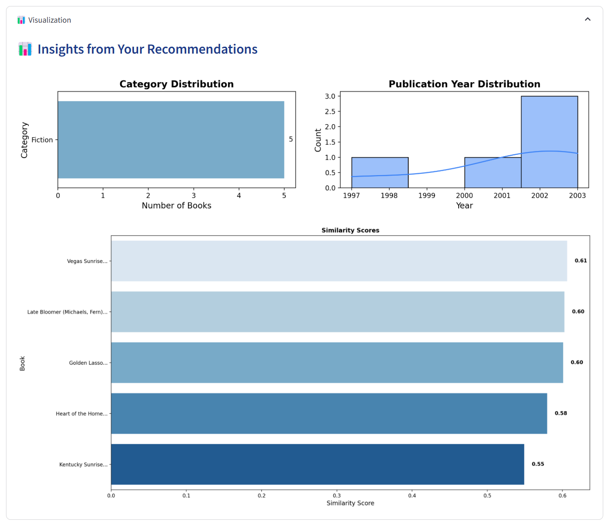

# ReadNext: Book Recommendation System

ReadNext is an intelligent book recommendation system that helps readers discover new books based on titles, authors, or keywords. Built with Streamlit and powered by machine learning, this application analyzes book summaries and metadata to suggest similar books you might enjoy.

## Features

- **Title-Based Recommendations**: Find similar books based on a title you enjoyed
- **Author Search**: Discover books by your favorite authors
- **Keyword Search**: Explore books related to specific themes or topics
- **Data Exploration**: Visualize dataset statistics including:
  - Category distribution
  - Publication year trends
  - Most prolific authors
  - Popular books by year
- **Random Book Suggestions**: Get spontaneous book recommendations

## Installation

### Prerequisites
- Python 3.8+
- Git

### Setup Instructions

1. Clone the repository:
   ```bash
   git clone https://github.com/yourusername/readnext.git
   cd readnext
   ```

2. Install required dependencies:
   ```bash
   pip install -r requirements.txt
   ```

3. Run the model notebook to generate the recommendation model:
   ```bash
   cd model
   jupyter notebook book_recommender.ipynb
   ```
   - Make sure to run all cells in the notebook to generate the `model.pkl` file

4. Return to the main directory and launch the Streamlit app:
   ```bash
   cd ..
   streamlit run app.py
   ```

5. Open your web browser and navigate to `http://localhost:8501`

## How It Works

ReadNext uses natural language processing and machine learning techniques to provide book recommendations:

1. **Text Preprocessing**: Book summaries and metadata are cleaned and processed using NLTK for lemmatization, stopword removal, and other NLP techniques

2. **Vectorization**: TF-IDF (Term Frequency-Inverse Document Frequency) creates numerical representations of books

3. **Similarity Calculation**: Cosine similarity measures how closely books relate to each other based on their content

4. **Filtering**: Advanced filters allow users to exclude categories or specify publication date ranges

## Project Structure

```
readnext/
├── app.py                 # Main Streamlit application
├── model/                 # Model training files
│   ├── book_recommender.ipynb   # Jupyter notebook for model creation
│   └── model.pkl          # Serialized model data
├── utils/                 # Utility functions
│   ├── util.py            # General utilities
│   ├── util_streamlit.py  # Streamlit-specific utilities
│   └── util_model.py      # Model-related utilities
├── styles/                # CSS styles
│   └── styles.css         # Custom styling
├── Dataset/               # Data files
│   └── books.csv          # Book dataset
├── images/                # Screenshots and images
└── requirements.txt       # Project dependencies
```

## Technologies Used

- **Streamlit**: Interactive web interface
- **scikit-learn**: Machine learning algorithms
- **NLTK**: Natural language processing
- **Pandas**: Data manipulation and analysis
- **Matplotlib/Seaborn**: Data visualization
- **Pickle**: Model serialization

## Screenshots

#### Interface


#### Example Result




## Future Improvements

- User accounts and personalized recommendations
- Integration with external book APIs for more comprehensive data
- Collaborative filtering based on user ratings
- Mobile-friendly responsive design
- Book availability and purchase links

## Contributing

Contributions are welcome! Please feel free to submit a Pull Request.

1. Fork the repository
2. Create your feature branch (`git checkout -b feature/amazing-feature`)
3. Commit your changes (`git commit -m 'Add some amazing feature'`)
4. Push to the branch (`git push origin feature/amazing-feature`)
5. Open a Pull Request

## License

This project is licensed under the MIT License - see the LICENSE file for details.

---
