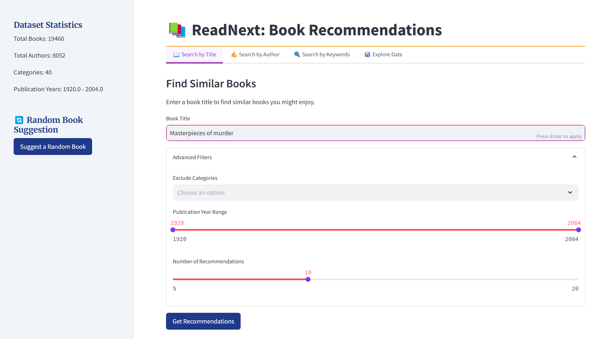
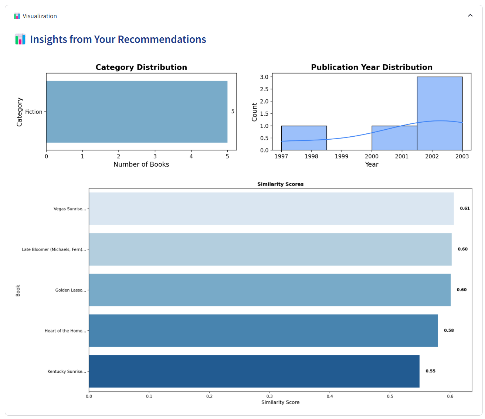

# ReadNext: Book Recommendation System

ReadNext is an intelligent book recommendation system that helps readers discover new books based on titles, authors, or keywords. Built with Streamlit and powered by machine learning, this application analyzes book summaries and metadata to suggest similar books you might enjoy.

- **Repository**: https://github.com/likhith-b-a/ReadNext
- **Live demo**: https://myreadnext.streamlit.app/

## Features

- **Title-Based Recommendations**: Find similar books based on a title you enjoyed
- **Author Search**: Discover books by your favorite authors
- **Keyword Search**: Explore books related to specific themes or topics
- **Data Exploration**: Visualize dataset statistics including:
  - Category distribution
  - Publication year trends
  - Most prolific authors
  - Popular books by year
- **Random Book Suggestions**: Get spontaneous book recommendations
- **Light/Dark Mode**: Follows your system or browser theme preference automatically

## Installation

### Prerequisites
- Python 3.8+
- Git

### Setup Instructions

1. Clone the repository:
   ```bash
   git clone https://github.com/yourusername/readnext.git
   cd readnext
   ```

2. Install required dependencies:
   ```bash
   pip install -r requirements.txt
   ```

3. Generate the recommendation model:
   ```bash
   cd model
   python book_recommender.py
   ```
   - This reads `model/Dataset/books.csv`, builds the TF-IDF model, and writes `model/model.pkl`
   - `book_recommender.ipynb` is the same pipeline in notebook form, kept for interactive exploration

4. Return to the main directory and launch the Streamlit app:
   ```bash
   cd ..
   streamlit run app.py
   ```

5. Open your web browser and navigate to `http://localhost:8501`

## How It Works

ReadNext uses natural language processing and machine learning techniques to provide book recommendations:

1. **Text Preprocessing**: Book summaries are cleaned and processed using NLTK for lemmatization, stopword removal, and other NLP techniques

2. **Weighted Vectorization**: Title, author, category and processed summary are combined into a single document per book (title and author repeated to weight them more heavily than summary text), joined with a separator token so n-grams never blend two different fields together, then vectorized with TF-IDF (Term Frequency-Inverse Document Frequency)

3. **Similarity Calculation**: Cosine similarity measures how closely books relate to each other based on their content; keyword search additionally boosts direct title/author substring matches, capped so the final relevance score stays on a consistent 0–1 scale

4. **Filtering**: Advanced filters allow users to exclude categories or specify publication date ranges

## Evaluation

ReadNext's search is unsupervised and content-based (TF-IDF + cosine similarity) — there's no click/purchase log to compute classic accuracy against, and checking whether recommendations share the query book's Category or Author would be circular, since those fields are already part of the model's own feature weighting.

Instead, `model/evaluate_search.py` measures whether search reliably finds the "obviously correct" book when given queries derived from that book's own content, checking whether the book's own title appears in the top-`K` (`K=3`) results. All numbers below are from a fixed random sample of 2,000 books (`seed=42`), so they're reproducible by re-running the script:

| Metric | Query used | Score |
|---|---|---|
| **Self-Retrieval@3** | The book's own full summary | 99.19% |
| **Masked-Retrieval@3** | Only the second half of the summary | 97.50% |
| **Structured-Keyword-Retrieval@3** | The book's own top-5 highest-weighted TF-IDF terms (e.g. `"kitchen amy chinese god wife"`) | 97.10% |
| **Structured-Keyword-Retrieval@3** | Same, but only the top-3 terms | 88.95% |

Self-Retrieval is a sanity check on the search plumbing itself (vectorization, indexing, similarity math) rather than a relevance judgment — it should stay very high, and a drop signals a pipeline bug. Structured-Keyword-Retrieval is the more realistic measure of actual search quality, since it simulates how a user really searches (a handful of keywords, not a full paragraph); comparing top-3 vs. top-5 keywords shows how score degrades as the query gets shorter and less specific.

Run it yourself with:
```bash
python model/evaluate_search.py
```

## Project Structure

```
readnext/
├── app.py                       # Main Streamlit application
├── .streamlit/
│   └── config.toml              # Theme/branding config
├── model/                       # Model training files
│   ├── Dataset/
│   │   └── books.csv            # Book dataset
│   ├── book_recommender.py      # Training script (canonical, run to regenerate model.pkl)
│   ├── book_recommender.ipynb   # Same pipeline as a notebook, for interactive exploration
│   ├── evaluate_search.py       # Offline search quality evaluation (see Evaluation section)
│   └── model.pkl                # Serialized model data
├── utils/                       # Utility functions
│   ├── util.py                  # General utilities (search, book cards, visualizations)
│   ├── util_streamlit.py        # Streamlit-specific utilities (inputs, filters)
│   └── util_model.py            # Model-related utilities (recommendation logic)
├── styles/                      # CSS styles
│   └── styles.css               # Custom styling, light/dark aware
├── images/                      # Screenshots and images
└── requirements.txt             # Project dependencies
```

## Technologies Used

- **Streamlit**: Interactive web interface
- **scikit-learn**: Machine learning algorithms
- **NLTK**: Natural language processing
- **Pandas**: Data manipulation and analysis
- **Matplotlib/Seaborn**: Data visualization
- **Pickle**: Model serialization

## Screenshots

#### Interface


#### Example Result




## Future Improvements

- User accounts and personalized recommendations
- Integration with external book APIs for more comprehensive data
- Collaborative filtering based on user ratings
- Mobile-friendly responsive design
- Book availability and purchase links
- Fuzzy/typo-tolerant title and author search

## Contributing

Contributions are welcome! Please feel free to submit a Pull Request.

1. Fork the repository
2. Create your feature branch (`git checkout -b feature/amazing-feature`)
3. Commit your changes (`git commit -m 'Add some amazing feature'`)
4. Push to the branch (`git push origin feature/amazing-feature`)
5. Open a Pull Request

## License

This project is licensed under the MIT License.

---
